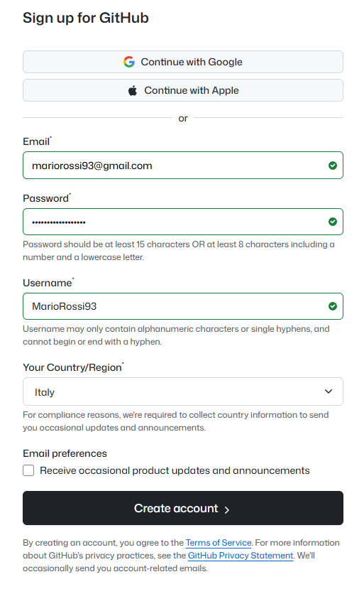
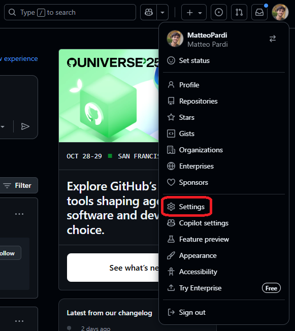
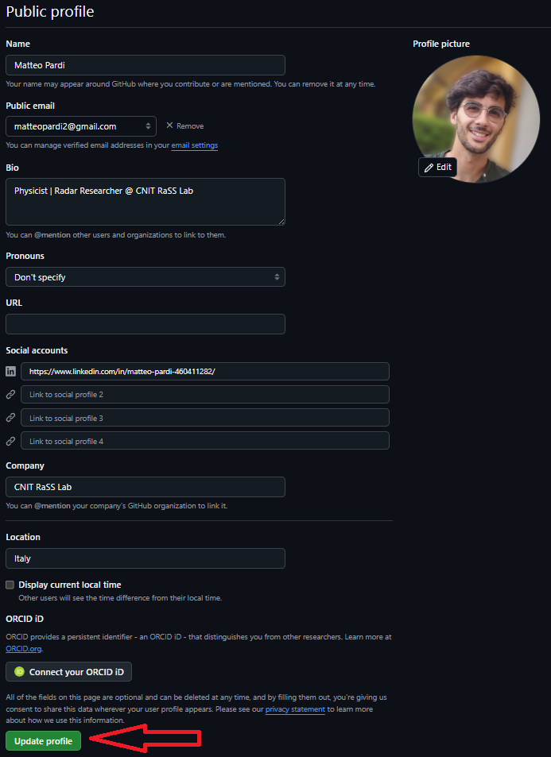
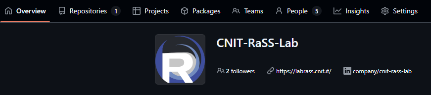
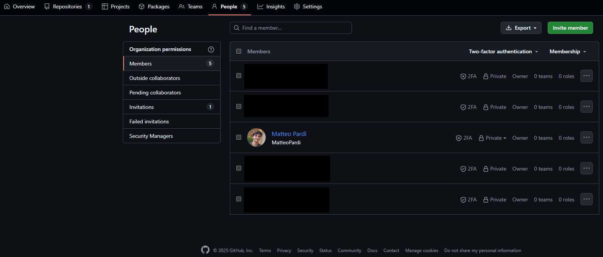
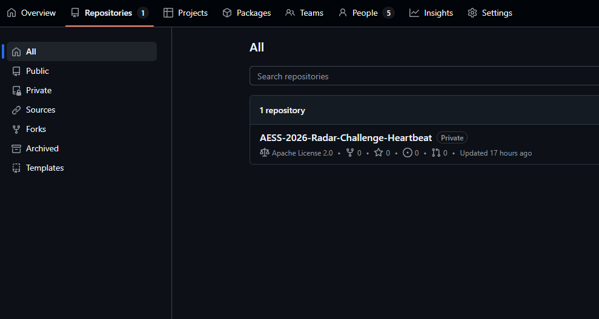

# Onboarding GitHub per il personale del RaSS Lab

## 1. Registrazione a GitHub

**GitHub** è una piattaforma per la gestione del codice sorgente e la collaborazione su progetti di sviluppo software.
Per iniziare, è sufficiente creare un account personale.

### Procedura di registrazione

Se è la prima volta che utilizzi GitHub, segui questi passaggi per registrarti. In caso contrario, accedi con il tuo account personale.

1. Vai su [https://github.com](https://github.com)
2. Clicca su **Sign up**.
3. Inserisci la **tua email personale** (es. `mariorossi93@gmail.com`) e scegli una **password sicura**.
   > Si può anche scegliere di procedere con `Continua con Google` o opzioni simili.
4. Scegli un **username** (sarà il nome pubblico del tuo profilo, es. `MarioRossi` o `MarioRossi93`)
5. Completa la **verifica** e il processo di registrazione.

Dopo la registrazione riceverai un’email di conferma: aprila e clicca su **Verify email address**.

## 2. Configurazione minimale del profilo

Una volta effettuato l’accesso, puoi impostare alcune informazioni di base per rendere il tuo profilo più riconoscibile e professionale.

### Come accedere alle impostazioni del profilo

1. In alto a destra, clicca sulla tua **foto profilo**
2. Seleziona **Settings → Profile**

### Campi essenziali da compilare

| Campo                     | Cosa inserire                                   | Note                                                                                                         |
| ------------------------- | ----------------------------------------------- | ------------------------------------------------------------------------------------------------------------ |
| **Name**                  | Il tuo nome e cognome                           | Esempio: `Mario Rossi`                                                                                       |
| **Bio**                   | Breve descrizione del tuo ruolo o attività      | Suggerimento: copia la bio da LinkedIn, es. `Telecommunications Engineer · Radar Researcher @ CNIT RaSS Lab` |
| **Avatar (foto profilo)** | Immagine professionale con il viso ben visibile | Suggerimento: usa la stessa foto di LinkedIn                                                                 |
| **Location**              | Città o semplicemente “Italy”                   | Facoltativo                                                                                                  |
| **Website**               | Link al tuo profilo LinkedIn o sito personale   | Esempio: `linkedin.com/in/mario-rossi`                                                                       |

## 3. Le organizzazioni su GitHub

Un’**organizzazione** su GitHub rappresenta un gruppo di lavoro, un’azienda o un ente di ricerca.
Proprio come un utente può avere repository personali, un’organizzazione può gestire repository condivisi tra i propri membri.

### Caratteristiche principali

* Ogni organizzazione ha un **nome**. Nel nostro caso: `CNIT-RaSS-Lab`.
* Al suo interno sono presenti **repository** condivisi (cioè i progetti).
  Questi possono essere:

  * **Pubblici** – per progetti aperti, didattici, partecipazioni a challenge o iniziative open source.
  * **Privati** – per attività interne o di sviluppo riservato, in cui si è scelto di usare GitHub come strumento di sviluppo e collaborazione.
  
  > ⚠️ **Attenzione:** per progetti che includono dati o know-how sensibile **non bisogna usare GitHub**, nemmeno con repository private.

* Gli utenti vengono aggiunti come **membri** con diversi livelli di permesso (Owner, Admin, Member, ecc.).
  Nel nostro caso, tutti i membri sono attualmente **Owner** *(da confermare)*.

### Come entrare nell’organizzazione CNIT-RaSS-Lab

Per entrare nell’organizzazione **CNIT-RaSS-Lab**, è sufficiente chiedere a uno degli amministratori di inviarti un invito.
Riceverai una notifica via email o direttamente su GitHub: clicca su **Join organization** per accettare.
